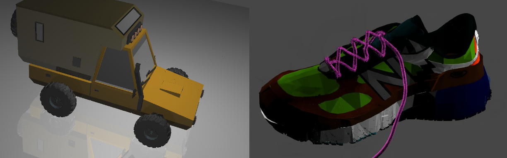

# capstone-fpga-raytracing

This was our Final-year Design Project (Capstone) at the University of Toronto Electrical and Computer Engineering department.

The project is a **ray-tracing** core that can be deployed on an FPGA. 
- Ray-tracing is a widely-used algorithm in computer graphics to create realistic 3D images and animations. Variations of it are used extensively by companies like Pixar and Dreamworks. It is typically very computationally intensive.
- FPGAs are devices that can offer significant advantages in performance over traditional devices (CPUs/GPUs), due to their lower latency and higher power efficiency. They're used in High Frequency Trading to make faster investment decisions, and Microsoft uses them to accelerate [AI (Project Brainwave)](https://www.microsoft.com/en-us/research/project/project-brainwave/) and [Azure](https://www.theregister.com/2023/11/21/azure_boost_network_accelerator/).
---
**Some images rendered by our FPGA core:**

 
_**Jeep** (13720 triangles, 7065 vertices), **Shoe** (62679 triangles, 65317 vertices)_ 

## Running this project
Follow README instructions for the [NewFPGA](https://github.com/capstone-fpga-raytracing/NewFPGA), [NewHPS](https://github.com/capstone-fpga-raytracing/NewHPS), and [host](https://github.com/capstone-fpga-raytracing/host) repos.   
Once done, you can trigger a render using our [command-line tool](https://github.com/capstone-fpga-raytracing/host).

We designed this for the DE1-SoC board, but it probably works on a DE10 as well.

